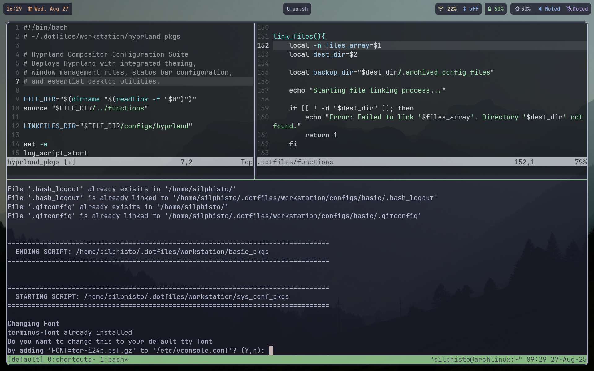
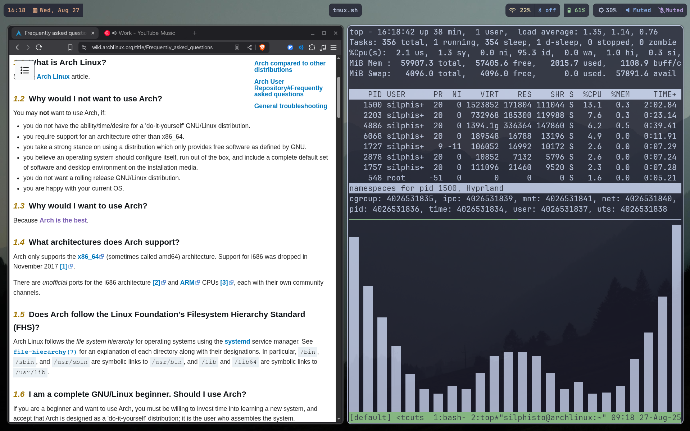

### My Hyprland Rice Configuration

My personal Hyprland setup and configuration files, packaged as an automated installer for Arch Linux.

## 🌾 My Linux Journey

I decided that to learn Linux, I was going to install Arch. What started as a simple desktop setup quickly became an obsession with customization!
The configuration files are largely based on blank. I started with installing the packages I wanted and then Hyprland. I then found myself putting a lot of effort into customizing this setup.
I thought to myself, "What if my computer blows up and I have to do all of this over again?!" Well, that led me into the Linux rabbit hole!
I started coding up bash scripts as a way to document my progress, and now I'm here posting my rice. This is just part one - there is still so much I want to improve.
Note: This installer specifically handles the Hyprland configuration and related dotfiles, not a complete system setup.
If you're interested in following my Linux journey, connect with me on LinkedIn!

## 📋 Roadmap

- [ ] Add more software relating to workflow
- [ ] Improve Bash Programming Pratices through functions


## 📸 Screenshots





## 🚀 Quick Start

### Prerequisites

- Fresh Arch Linux installation
- Internet connection
- User with sudo privileges
- Yay Installer

### Installation

1. Clone the repository:
```bash
git clone https://github.com/jlopez6077/hyprland-rice.git
cd hyprland-rice
```

2. Make the script executable:
```bash
chmod +x hyprland_pkg
```

3. Run the installer:
```bash
./hyprland_pkg
```

4. Follow the prompts and reboot when finished

## ⚙️ Configuration

Feel free to modify the configuration files to suit your preferences.

## 📄 License

This project is licensed under the MIT License - see the [LICENSE](MIT_Licease.txt) file for details.

## 🙏 Acknowledgments

- [Hyprland](https://hyprland.org/) - Amazing Wayland compositor
- [r/unixporn](https://reddit.com/r/unixporn) - Inspiration and community

*Made with ❤️ for the Linux community*
